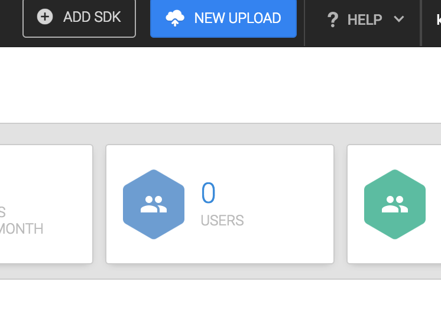
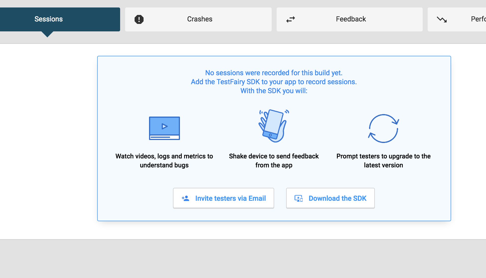

# Android Testing       

## [TestFairy](https://www.testfairy.com/)
I used TestFairy for Android Testing of builds. I found the TestFairy process to be way simpler than deploying to TestFlight for iOS -- mostly because TestFlight for iOS has to go through App Store Connect.

### Here are the Steps:

1. Sign Up or Log In to your TestFairy account [here](https://www.testfairy.com/)
2. Click the "NEW UPLOAD" button at the top of the page

    
    
3. Drag your build file into the file drop area and voila! 
4. Once the build loads in, a pop up shows up to offer to send an email with a link to install your build! 
5. To add new testers, make sure you are in the right app, then click onto the build version that you are testing. 
6. Click on the "Invite Testers via Email" button
    
7. Enter email(s) to create new tester(s), edit the comments as needed, then click "Invite Selected Testers"
    - An email will be sent to those emails with a link to download the app to their Android Device.
    - App can only be tested on the device the build was set to (aka. Android in this case)

